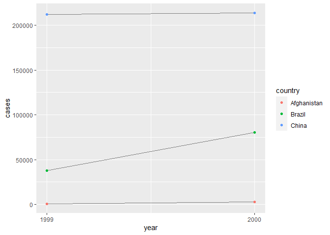

# Assignment_2
HM2
================
by Tamires Amorim
3/2/2021

Loading packages:

    ## Warning: package 'tidyverse' was built under R version 4.0.3

    ## -- Attaching packages ------------------------ tidyverse 1.3.0 --

    ## v ggplot2 3.3.3     v purrr   0.3.4
    ## v tibble  3.0.3     v dplyr   1.0.3
    ## v tidyr   1.1.2     v stringr 1.4.0
    ## v readr   1.3.1     v forcats 0.5.0

    ## Warning: package 'ggplot2' was built under R version 4.0.3

    ## Warning: package 'purrr' was built under R version 4.0.3

    ## Warning: package 'dplyr' was built under R version 4.0.3

    ## Warning: package 'stringr' was built under R version 4.0.3

    ## -- Conflicts --------------------------- tidyverse_conflicts() --
    ## x dplyr::filter() masks stats::filter()
    ## x dplyr::lag()    masks stats::lag()

    ## 
    ## Attaching package: 'data.table'

    ## The following objects are masked from 'package:dplyr':
    ## 
    ##     between, first, last

    ## The following object is masked from 'package:purrr':
    ## 
    ##     transpose

    ## Warning: package 'DT' was built under R version 4.0.3

Understanding what is the information contained in the tables, before
starting the analysis:

``` r
glimpse(table1) #identification of characters, integers and so on.
```

    ## Rows: 6
    ## Columns: 4
    ## $ country    <chr> "Afghanistan", "Afghanistan", "Brazil", "Brazil", "China...
    ## $ year       <int> 1999, 2000, 1999, 2000, 1999, 2000
    ## $ cases      <int> 745, 2666, 37737, 80488, 212258, 213766
    ## $ population <int> 19987071, 20595360, 172006362, 174504898, 1272915272, 12...

``` r
# on the console write: ?table1 , there I found the description of the data in all the tables

#all display the number of TB cases documented by the World Health Organization in Afghanistan, Brazil, and China between 1999 and 2000. The data contains values associated with four variables (country, year, cases, and population), but each table organizes the values in a different layout.
```

### Homework 2:

#### 12.2.1 Exercises

##### Using prose, describe how the variables and observations are organised in each of the sample tables

Sample table 1: The rows have country, and year. The columns cases and
populations related to the year and country. Sample table 2: Each row
describes a country and year combined. The column “count” includes cases
and population in separated rows. Sample table 3: the rows represent
country and year, the columns shows the rate (number of cases divided by
population). Sample table4a: shows values of cases, where the row is the
country and the column is the year (1999,2000). sample table4b:
represents values of population, where the row is the country and the
column is the year (1999,2000). Sample table 5: works similarly with
table 3, the difference is that there is an addition of the column
century.

``` r
table1
```

    ## # A tibble: 6 x 4
    ##   country      year  cases population
    ##   <chr>       <int>  <int>      <int>
    ## 1 Afghanistan  1999    745   19987071
    ## 2 Afghanistan  2000   2666   20595360
    ## 3 Brazil       1999  37737  172006362
    ## 4 Brazil       2000  80488  174504898
    ## 5 China        1999 212258 1272915272
    ## 6 China        2000 213766 1280428583

``` r
table2
```

    ## # A tibble: 12 x 4
    ##    country      year type            count
    ##    <chr>       <int> <chr>           <int>
    ##  1 Afghanistan  1999 cases             745
    ##  2 Afghanistan  1999 population   19987071
    ##  3 Afghanistan  2000 cases            2666
    ##  4 Afghanistan  2000 population   20595360
    ##  5 Brazil       1999 cases           37737
    ##  6 Brazil       1999 population  172006362
    ##  7 Brazil       2000 cases           80488
    ##  8 Brazil       2000 population  174504898
    ##  9 China        1999 cases          212258
    ## 10 China        1999 population 1272915272
    ## 11 China        2000 cases          213766
    ## 12 China        2000 population 1280428583

``` r
table3
```

    ## # A tibble: 6 x 3
    ##   country      year rate             
    ## * <chr>       <int> <chr>            
    ## 1 Afghanistan  1999 745/19987071     
    ## 2 Afghanistan  2000 2666/20595360    
    ## 3 Brazil       1999 37737/172006362  
    ## 4 Brazil       2000 80488/174504898  
    ## 5 China        1999 212258/1272915272
    ## 6 China        2000 213766/1280428583

``` r
table4a
```

    ## # A tibble: 3 x 3
    ##   country     `1999` `2000`
    ## * <chr>        <int>  <int>
    ## 1 Afghanistan    745   2666
    ## 2 Brazil       37737  80488
    ## 3 China       212258 213766

``` r
table4b
```

    ## # A tibble: 3 x 3
    ##   country         `1999`     `2000`
    ## * <chr>            <int>      <int>
    ## 1 Afghanistan   19987071   20595360
    ## 2 Brazil       172006362  174504898
    ## 3 China       1272915272 1280428583

``` r
table5
```

    ## # A tibble: 6 x 4
    ##   country     century year  rate             
    ## * <chr>       <chr>   <chr> <chr>            
    ## 1 Afghanistan 19      99    745/19987071     
    ## 2 Afghanistan 20      00    2666/20595360    
    ## 3 Brazil      19      99    37737/172006362  
    ## 4 Brazil      20      00    80488/174504898  
    ## 5 China       19      99    212258/1272915272
    ## 6 China       20      00    213766/1280428583

##### Compute the rate for table2, and table4a + table4b. You will need to perform four operations:

From my perspective, the table 2 is harder because it has separate rows
for cases and population, which lead me to create a new table with the
columns for calculating cases per capita. For table4a and 4b since it is
already split, meaning one for cases and the other for population, I
just had to divide cases by population.

Table 2:

``` r
tb2_cases <- filter(table2, type == "cases") %>%
  rename(cases = count) %>%
  arrange(country, year)
tb2_population <- filter(table2, type == "population") %>%
  rename(population = count) %>%
  arrange(country, year)

###checking if it worked:

tb2_cases
```

    ## # A tibble: 6 x 4
    ##   country      year type   cases
    ##   <chr>       <int> <chr>  <int>
    ## 1 Afghanistan  1999 cases    745
    ## 2 Afghanistan  2000 cases   2666
    ## 3 Brazil       1999 cases  37737
    ## 4 Brazil       2000 cases  80488
    ## 5 China        1999 cases 212258
    ## 6 China        2000 cases 213766

``` r
tb2_population
```

    ## # A tibble: 6 x 4
    ##   country      year type       population
    ##   <chr>       <int> <chr>           <int>
    ## 1 Afghanistan  1999 population   19987071
    ## 2 Afghanistan  2000 population   20595360
    ## 3 Brazil       1999 population  172006362
    ## 4 Brazil       2000 population  174504898
    ## 5 China        1999 population 1272915272
    ## 6 China        2000 population 1280428583

``` r
## data frame with population and cases columns 

tb2_cases_per_cap <- tibble(
  year = tb2_cases$year,
  country = tb2_cases$country,
  cases = tb2_cases$cases,
  population = tb2_population$population
) %>%
  mutate(cases_per_cap = (cases / population) * 10000) %>%
  select(country, year, cases_per_cap)

tb2_cases_per_cap
```

    ## # A tibble: 6 x 3
    ##   country      year cases_per_cap
    ##   <chr>       <int>         <dbl>
    ## 1 Afghanistan  1999         0.373
    ## 2 Afghanistan  2000         1.29 
    ## 3 Brazil       1999         2.19 
    ## 4 Brazil       2000         4.61 
    ## 5 China        1999         1.67 
    ## 6 China        2000         1.67

``` r
## Storing the variable as a new row in the table two

tb2_cases_per_cap <- tb2_cases_per_cap %>%
  mutate(type = "cases_per_cap") %>%
  rename(count = cases_per_cap)

bind_rows(table2, tb2_cases_per_cap) %>%
  arrange(country, year, type, count)
```

    ## # A tibble: 18 x 4
    ##    country      year type            count
    ##    <chr>       <int> <chr>           <dbl>
    ##  1 Afghanistan  1999 cases         7.45e+2
    ##  2 Afghanistan  1999 cases_per_cap 3.73e-1
    ##  3 Afghanistan  1999 population    2.00e+7
    ##  4 Afghanistan  2000 cases         2.67e+3
    ##  5 Afghanistan  2000 cases_per_cap 1.29e+0
    ##  6 Afghanistan  2000 population    2.06e+7
    ##  7 Brazil       1999 cases         3.77e+4
    ##  8 Brazil       1999 cases_per_cap 2.19e+0
    ##  9 Brazil       1999 population    1.72e+8
    ## 10 Brazil       2000 cases         8.05e+4
    ## 11 Brazil       2000 cases_per_cap 4.61e+0
    ## 12 Brazil       2000 population    1.75e+8
    ## 13 China        1999 cases         2.12e+5
    ## 14 China        1999 cases_per_cap 1.67e+0
    ## 15 China        1999 population    1.27e+9
    ## 16 China        2000 cases         2.14e+5
    ## 17 China        2000 cases_per_cap 1.67e+0
    ## 18 China        2000 population    1.28e+9

Table 4a and 4b:

``` r
table4_cases_per_capita <- tibble(
    country = table4a$country,
    `1999` = table4a[["1999"]] / table4b[["1999"]] * 10000,
    `2000` = table4a[["2000"]] / table4b[["2000"]] * 10000
  )
table4_cases_per_capita
```

    ## # A tibble: 3 x 3
    ##   country     `1999` `2000`
    ##   <chr>        <dbl>  <dbl>
    ## 1 Afghanistan  0.373   1.29
    ## 2 Brazil       2.19    4.61
    ## 3 China        1.67    1.67

##### Recreate the plot showing change in cases over time using table2 instead of table1. What do you need to do first?

First we need to filter the table2 with rows that represent cases of
Tuberculosis.Then plot the relationship between cases by year and
country.

``` r
table2 %>%
  filter(type == "cases") %>%
  ggplot(aes(year, count)) +
  geom_line(aes(group = country), colour = "grey50") +
  geom_point(aes(colour = country)) +
  scale_x_continuous(breaks = unique(table2$year)) +
  ylab("cases")
```

<!-- -->

#### b) 12.3.3 Exercises

##### Why are pivot\_longer() and pivot\_wider() not perfectly symmetrical? Carefully consider the following example:

They are not symmetrical because pivot\_longer() makes wide tables
narrower and longer; pivot\_wider() makes long tables shorter and wider.
When converting from wide to long you can lost the information from
column type.

The names\_to="", in the pivot\_longer() function, makes the column to
be a character (name).

``` r
stocks <- tibble(
  year   = c(2015, 2015, 2016, 2016),
  half  = c(   1,    2,     1,    2),
  return = c(1.88, 0.59, 0.92, 0.17)
)
stocks %>% 
  pivot_wider(names_from = year, values_from = return) %>% 
    pivot_longer(`2015`:`2016`, names_to = "year", values_to = "return")
```

    ## # A tibble: 4 x 3
    ##    half year  return
    ##   <dbl> <chr>  <dbl>
    ## 1     1 2015    1.88
    ## 2     1 2016    0.92
    ## 3     2 2015    0.59
    ## 4     2 2016    0.17

#### c) 12.5.1 Exercises

##### Compare and contrast the fill arguments to pivot\_wider() and complete().

To replace NAs in the data set you can add fill or complete to the
pivot\_wider() function. The values\_fill argument in pivot\_wider()
“takes the set of columns where you want missing values to be replaced
by the most recent non-missing value”. the complete() “takes a set of
columns, and finds all unique combinations. It then ensure the original
dataset contains all those values, filling in explicit NAs where
necessary”. The difference is that values\_fill accepts a single value,
and complete() it can have sets of values to replace NAs.

For Values\_fill = 0, we have:

``` r
stocks <- tibble(
  year   = c(2015, 2015, 2015, 2015, 2016, 2016, 2016),
  qtr    = c(   1,    2,    3,    4,    2,    3,    4),
  return = c(1.88, 0.59, 0.35,   NA, 0.92, 0.17, 2.66)
)
stocks %>% 
  pivot_wider(names_from = year, values_from = return,
              values_fill = 0)
```

    ## # A tibble: 4 x 3
    ##     qtr `2015` `2016`
    ##   <dbl>  <dbl>  <dbl>
    ## 1     1   1.88   0   
    ## 2     2   0.59   0.92
    ## 3     3   0.35   0.17
    ## 4     4  NA      2.66

For the Complete() argument:

``` r
stocks %>% 
 complete(year, qtr, fill=list(return=0))
```

    ## # A tibble: 8 x 3
    ##    year   qtr return
    ##   <dbl> <dbl>  <dbl>
    ## 1  2015     1   1.88
    ## 2  2015     2   0.59
    ## 3  2015     3   0.35
    ## 4  2015     4   0   
    ## 5  2016     1   0   
    ## 6  2016     2   0.92
    ## 7  2016     3   0.17
    ## 8  2016     4   2.66

##### What does the direction argument to fill() do?

The direction will determine if NA values should be replaced by the
previous non-missing value (“down”) or the next non-missing value
(“up”).

``` r
# No fill
stocks
```

    ## # A tibble: 7 x 3
    ##    year   qtr return
    ##   <dbl> <dbl>  <dbl>
    ## 1  2015     1   1.88
    ## 2  2015     2   0.59
    ## 3  2015     3   0.35
    ## 4  2015     4  NA   
    ## 5  2016     2   0.92
    ## 6  2016     3   0.17
    ## 7  2016     4   2.66

``` r
# fill with direction = "down"
stocks %>% fill(return, .direction = "down")
```

    ## # A tibble: 7 x 3
    ##    year   qtr return
    ##   <dbl> <dbl>  <dbl>
    ## 1  2015     1   1.88
    ## 2  2015     2   0.59
    ## 3  2015     3   0.35
    ## 4  2015     4   0.35
    ## 5  2016     2   0.92
    ## 6  2016     3   0.17
    ## 7  2016     4   2.66

``` r
# fill with direction = "up"
stocks %>% fill(return, .direction = "up")
```

    ## # A tibble: 7 x 3
    ##    year   qtr return
    ##   <dbl> <dbl>  <dbl>
    ## 1  2015     1   1.88
    ## 2  2015     2   0.59
    ## 3  2015     3   0.35
    ## 4  2015     4   0.92
    ## 5  2016     2   0.92
    ## 6  2016     3   0.17
    ## 7  2016     4   2.66
